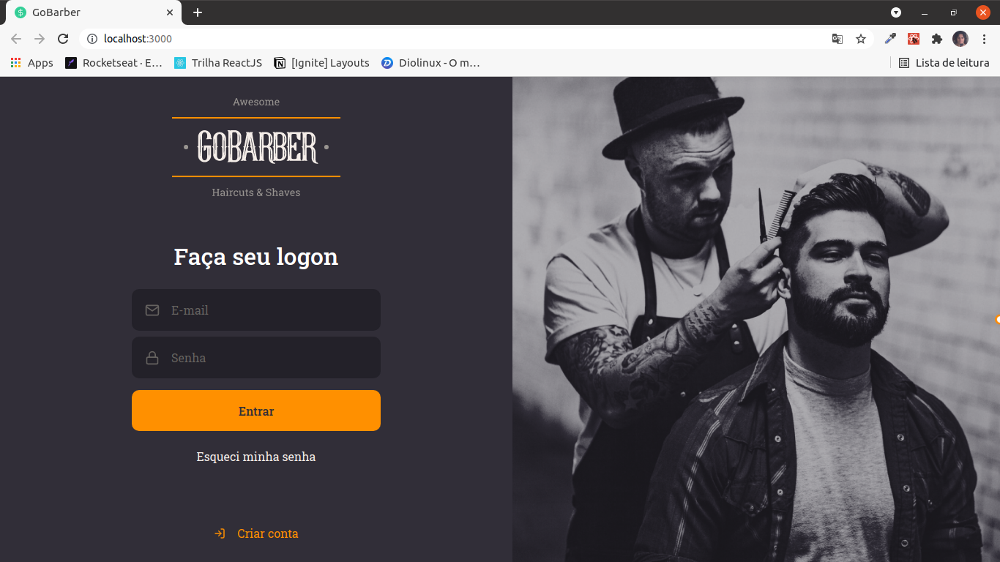
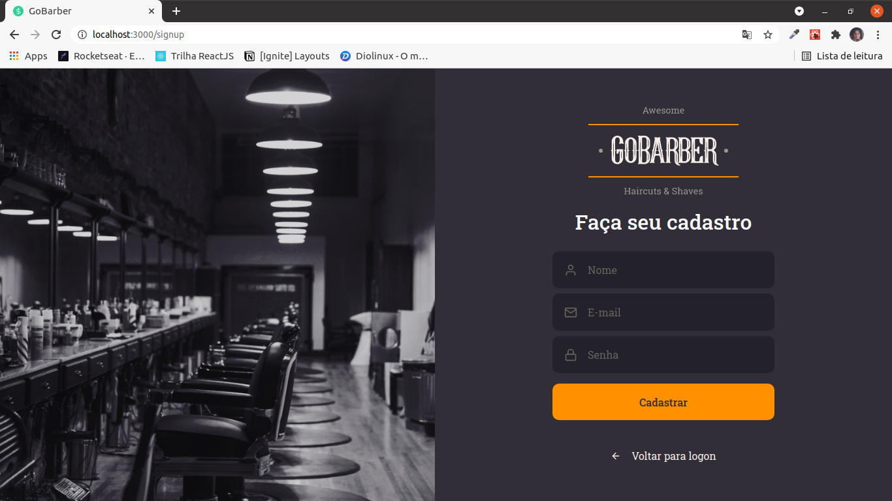
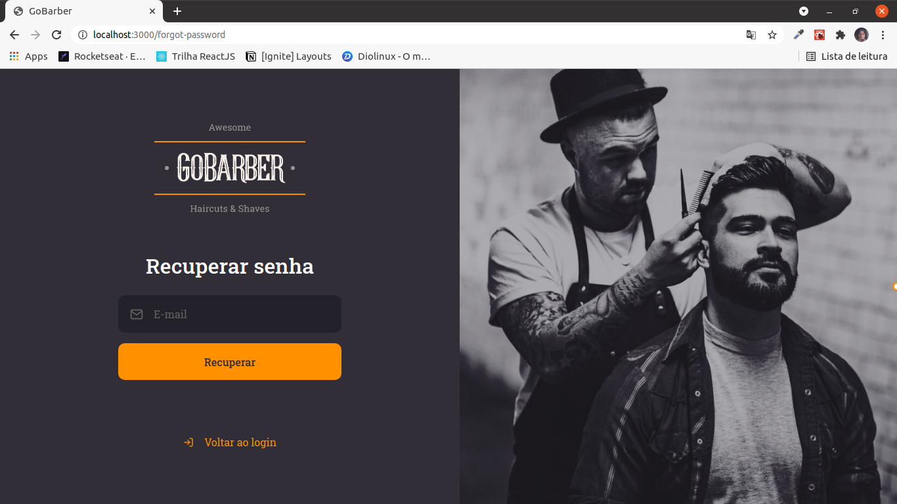
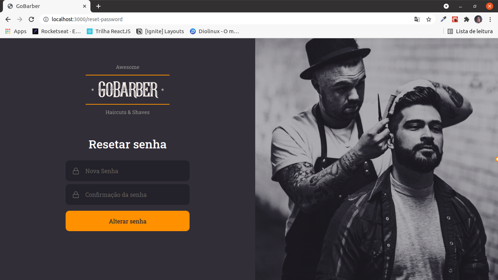
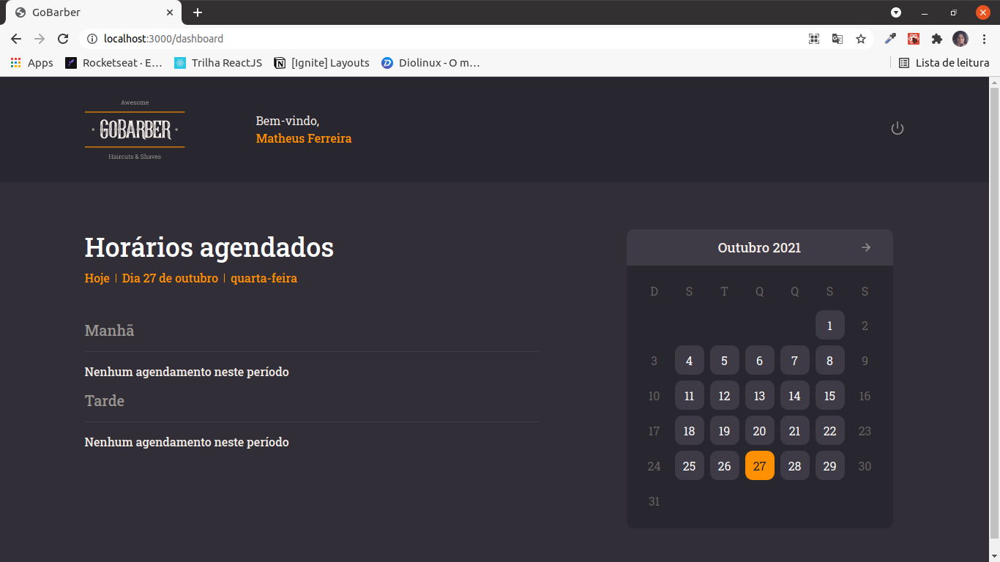
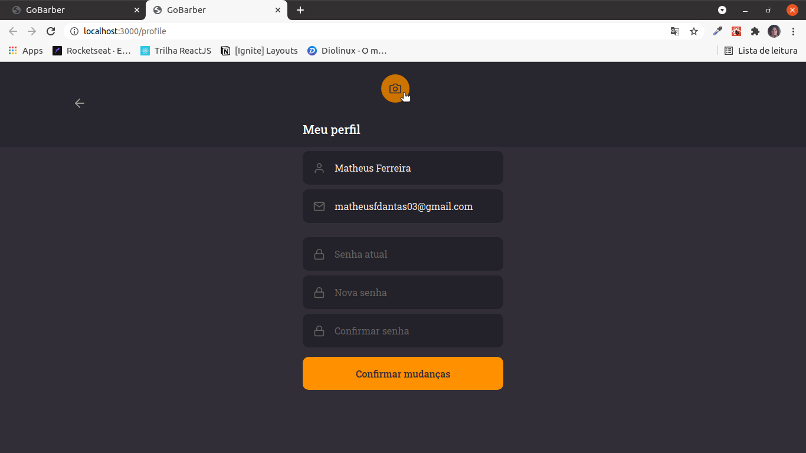

<h1 align="center">
  
</h1>

## Primeiro Acesso
### Clonando o projeto
```
$ git clone https://github.com/matheusfd3/gobarber-web.git
```
### Baixando as dependências
Na pasta do projeto execute o comando abaixo com o [Yarn](https://yarnpkg.com/lang/pt-br/).
```
$ yarn install
```
### Rodando no localhost
```
$ yarn start
```
Acesse [http://localhost:3000/](http://localhost:3000/).
### Backend
Esse projeto precisa do backend [gobarber-api](https://github.com/matheusfd3/gobarber-api) para funcionar corretamente.

## Páginas
### **Login**
<h2 align="center">
  
</h2>

### **Cadastrar**
<h2 align="center">
  
</h2>

### **Esqueci minha senha**
<h2 align="center">
  
</h2>

### **Resetar senha**
<h2 align="center">
  
</h2>

### **Dashboard**
<h2 align="center">
  
</h2>

### **Perfil**
<h2 align="center">
  
</h2>
